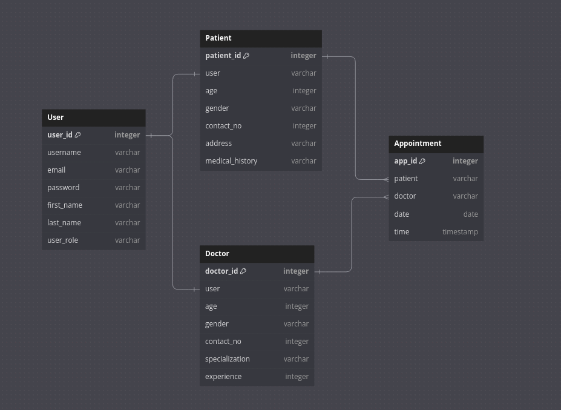

# City Hospital

### Appoinment Scheduler made with Django


`CityHospital` is a `Python` based WebApp that allows `Patients` to schedule `Appointments` with `Doctors`.

Project is made with `Django Framework` and uses `SQLite Database` for storing data. The project is deployed on `PythonAnywhere` and Source Code is hosted on `GitHub`.

[](https://masifansari1.pythonanywhere.com)

[](https://masifansari1.pythonanywhere.com)

<details>
<summary>
Demo Credentials for Website
</summary>

- Demo credentials for the website can be found in the `DOCTOR.MD` & `PATIENT.MD` files.

- Or you can create your own user profile and use them to login to the website.

</details>

## Installing and Running CityHospital Locally

<details>
<summary> 
  <b>Installation Steps</b>
  
</summary>
<br>
Clone the repository:

```
git clone https://github.com/m-asif-ansari/CityHospital_Django.git
```

Activate the virtual environment:

```
# LINUX and macOS:
source .venv/bin/activate
```

```
# WINDOWS:
.venv\Scripts\activate
```

Install the dependencies:

```
pip install -r requirements.txt
```

Open the CityHospital folder:

```
cd CityHospital_Django/CityHospital
```

Run the server:

```
python manage.py runserver
```

</details>

## Database Design

The database design is based on the following diagram:



### Table Description

<details>
<summary> 
  <b>User Table</b>
</summary>

- Inherits from AbstractUser, allowing for Django's authentication system.
- This field allows the system to distinguish between patients and doctors at the user level.
- Contains only the relevant fields for authentication purposes.
- It supports features like login, logout, password change, etc.

</details>
<br>

<details>
<summary> 
  <b>Patient Table</b>
</summary>

- Extends the User model, adding patient-specific information.
- Allows for storing detailed patient information separate from the core user data.
- The one-to-one relationship ensures that each user can be a patient only once.

</details>
<br>

<details>
<summary> 
  <b>Doctor Table</b>
</summary>

- Extends the User model, adding doctor-specific information.
- Allows for storing detailed doctor information separate from the core user data.
- The one-to-one relationship ensures that each user can be a doctor only once.
</details>
<br>

<details>
<summary> 
  <b>Appointment Table</b>
</summary>

- Contains the appointment details while creating a relationship between Patients and Doctors.
- The appointment is scheduled for a specific date and pre-defined time slot.
- It has a many-to-one relationship with the Patient and Doctor models. So that each appointment can only be associated with a single patient and doctor.

</details>

## Contact

If you want to contact me you can reach me at <asif16907@gmail.com>.
